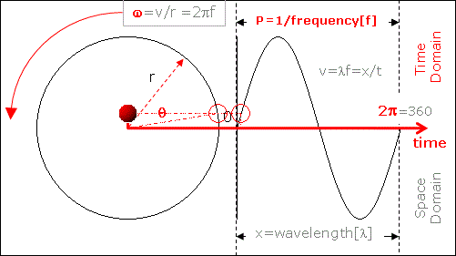

![[image-30.png]]

---
![[image-31.png]]
### 🔥 **Chapter-wise Heatmap Analysis (Based on Past Frequency)**

| Chapter                       | Frequency | Priority     |
| ----------------------------- | --------- | ------------ |
| Ownership Structure           | 11        | 🔴 Very High |
| HR Management                 | 10        | 🔴 Very High |
| Accounting                    | 6         | 🟠 High      |
| The Business – Nature & Scope | 5         | 🟡 Medium    |
| Finance                       | 5         | 🟡 Medium    |
| Marketing                     | 5         | 🟡 Medium    |
| Production & Operations       | 2         | 🔵 Low       |

---

### 🕒 **5-Hour Study Plan (Focused + Balanced)**

| Time      | Chapter                      | Focus                                                                |
| --------- | ---------------------------- | -------------------------------------------------------------------- |
| 0:00–0:45 | **Ownership Structure** 🔴   | Sole prop., partnership, deed, joint stock, co-op, franchise, merits |
| 0:45–1:30 | **HR Management** 🔴         | Management vs admin, motivation (Maslow, McGregor), conflict, HRM    |
| 1:30–2:00 | **Accounting** 🟠            | AIS, recording steps, users, journal entries, statements             |
| 2:00–2:30 | **Break / Light Review**     | Review notes / flashcards                                            |
| 2:30–3:00 | **The Business (Basics)** 🟡 | Meaning, scope, objectives, business vs profession, environments     |
| 3:00–3:30 | **Finance** 🟡               | Working capital, sources, planning, profit vs wealth maximization    |
| 3:30–4:00 | **Marketing** 🟡             | Marketing mix, strategy, 4Ps, stages, channels                       |
| 4:00–4:30 | **Production & Ops** 🔵      | Plant location/layout, inventory, quality control                    |
| 4:30–5:00 | **Mock Questions / Recall**  | Try 1–2 past questions from top 3 chapters                           |

---

### ✅ Tips:

* Focus most on **Ownership**, **HRM**, and **Accounting**.
* Chapters like **Production & Operation** are low-frequency—read lightly.
* Practice past paper MCQs or 14-mark questions during the last 30 mins.

Got it — it's now **2:34 AM**, and you have only **8 hours left** before your **BUS1123 exam**. That means you must finish revision by around **10:30 AM** (allowing time to freshen up, commute, or rest).

Let’s create a **Focused 6-Hour Crash Plan + 2 Hours Buffer**:

---

### 🕒 **2:34 AM – 8:34 AM** (💥 6-Hour Intensive Revision Plan)

| Time            | Chapter                                   | Focus Area                                                                  |
| --------------- | ----------------------------------------- | --------------------------------------------------------------------------- |
| **2:34 – 3:19** | 🔴 Ownership Structure (45 min)           | Sole proprietorship, partnership, deed, joint stock, merits/demerits        |
| **3:19 – 4:04** | 🔴 HR Management (45 min)                 | McGregor, Maslow, manager roles, recruitment, training, conflict management |
| **4:04 – 4:34** | 🟠 Accounting (30 min)                    | Journal entries, AIS, users, financial statements                           |
| **4:34 – 5:04** | ☕ Break + Light Flashcard Review (30 min) |                                                                             |
| **5:04 – 5:34** | 🟡 The Business (30 min)                  | Definition, environment, entrepreneur traits, objectives                    |
| **5:34 – 6:04** | 🟡 Finance (30 min)                       | Working capital, sources of finance, profit vs. wealth maximization         |
| **6:04 – 6:34** | 🟡 Marketing (30 min)                     | Marketing mix, strategy, importance of promotion                            |
| **6:34 – 7:04** | 🔵 Production & Ops (30 min)              | Plant layout vs location, inventory, quality control                        |
| **7:04 – 8:04** | 🎯 Rapid Fire Practice (1 hour)           | Attempt 1–2 questions each from Ownership, HRM, Accounting, and Marketing   |
| **8:04 – 8:34** | 🧘‍♂️ Final Review & Light Rest           | Breathe, revise key lists and short notes (no new reading)                  |

---

### ✅ Key Priorities:

* **Don't waste time on new topics**.
* Focus on **frequently asked areas** (ownership, HRM, accounting).
* **Avoid perfectionism** — aim for 70–80% clarity.
* Use mnemonics, bullet points, or Bengali keywords if needed.

---

Would you like a one-page cheat sheet of **definitions + lists** to cram now? I can generate it in 5 mins.
